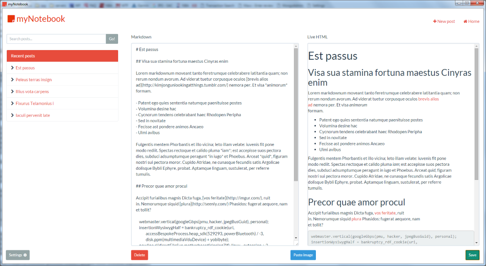
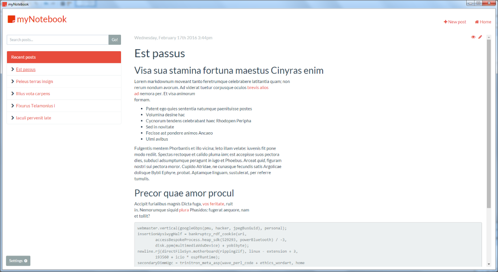
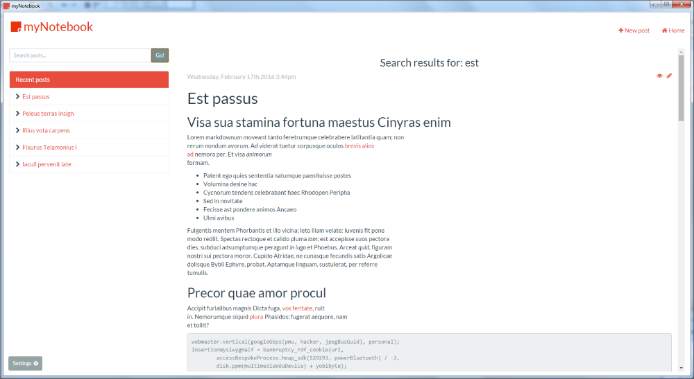
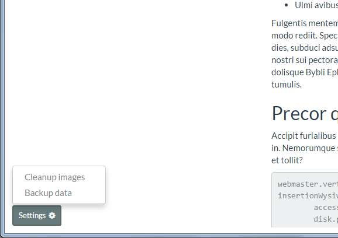
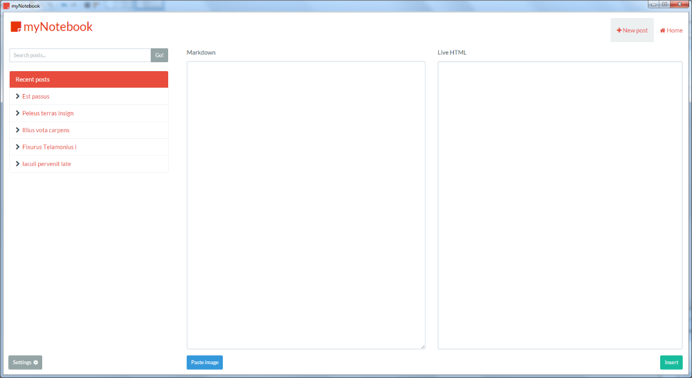

# myNotebook

A cross-platform (Electron) SPA application which can be used to take notes, edit Markdown, create blog posts, keep screenshots and be used as a general diary. `myNotebook` is built using Github's 
[Electron](http://electron.atom.io/) framework that be can be run on Windows/Mac (OSX) and Linux. 

`myNotebook` can be used as an example application in using Electron to build a SPA using Angular 
with routing. 

## Installation

Running the application can be done by following the below process:

1. Clone Repository: `git clone https://github.com/mrvautin/myNotebook.git && cd myNotebook/app`
2. Install dependencies: `npm install`
3. Start the application: `npm start`

## Packaging

You can package the app with [electron-packager](https://github.com/maxogden/electron-packager) so it can be run directly from the `dmg`, `exe` 
etc rather than from `npm start` in the command line. This can be done using the following commands from the 
root of the download:

#### Ensure all is installed

Run `npm install` from the root of the repo.

#### Windows

`npm run pack:win`

#### Mac (OSX)

`npm run pack:osx`

#### All

`npm run pack`

## Building installer

Installers can be built (not thoroughly tested) using the [electron-builder](https://github.com/loopline-systems/electron-builder)
package. Scripts have been included in the `package.json` in the root of the repository.

After packaging as per above you can build using:

#### Windows

`npm run build:win`

#### Mac (OSX)

`npm run build:osx`

#### All

`npm run build`

## Using

Usage is pretty easy. Links to add new posts is in the top right corner, recent posts are listed on the left.
Editing a post is done by clicking the pencil icon to the right of the published date. From there the post can be updated, deleted etc.
Images can be added directly from the clipboard. Once in the editor/new screen the `Paste image` button can be clicked to 
import the image and insert a link.

Dead images can be cleaned through the `Settings` menu.

## Searching posts

The search functionality is built using the very powerful [Lunr](https://github.com/olivernn/lunr.js) search. All posts are indexed and full text searching can be
done using any words. 

## Screenshots

#### Editor

#### Post view

#### Searching

#### Settings

#### Insert new post

## Contributing

1. Fork it!
2. Create your feature branch: `git checkout -b my-new-feature`
3. Commit your changes: `git commit -am 'Add some feature'`
4. Push to the branch: `git push origin my-new-feature`
5. Submit a pull request :D

## License

The MIT License (MIT)
Copyright (c) 2016 Mark Moffat

Permission is hereby granted, free of charge, to any person obtaining a copy of this software and associated documentation files (the "Software"), to deal in the Software without restriction, including without limitation the rights to use, copy, modify, merge, publish, distribute, sublicense, and/or sell copies of the Software, and to permit persons to whom the Software is furnished to do so, subject to the following conditions:

The above copyright notice and this permission notice shall be included in all copies or substantial portions of the Software.

THE SOFTWARE IS PROVIDED "AS IS", WITHOUT WARRANTY OF ANY KIND, EXPRESS OR IMPLIED, INCLUDING BUT NOT LIMITED TO THE WARRANTIES OF MERCHANTABILITY, FITNESS FOR A PARTICULAR PURPOSE AND NONINFRINGEMENT. IN NO EVENT SHALL THE AUTHORS OR COPYRIGHT HOLDERS BE LIABLE FOR ANY CLAIM, DAMAGES OR OTHER LIABILITY, WHETHER IN AN ACTION OF CONTRACT, TORT OR OTHERWISE, ARISING FROM, OUT OF OR IN CONNECTION WITH THE SOFTWARE OR THE USE OR OTHER DEALINGS IN THE SOFTWARE.